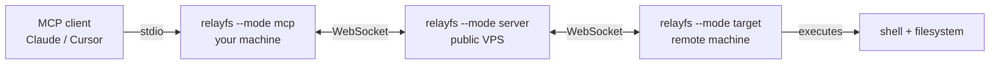

# relayfs

Remote shell + filesystem access over a relay, with a **true FUSE mount** of a
remote directory into your local filesystem.

**One binary, three modes:**



- **`--mode server`** — public WebSocket hub. Both ends connect *out* to it,
  so neither machine needs a public IP or open ports. Pairs mcp and target by
  a shared token; forwards JSON-RPC frames without inspecting them.
- **`--mode mcp`** — MCP server on your machine. Exposes the remote machine
  as MCP tools (`run_command`, `read_file`, `write_file`, `upload_file`,
  `download_file`, `list_dir`, `stat`, `mkdir`, `remove`, `rename`, `copy`,
  `mount_remote`, `unmount_remote`, `list_mounts`, `ping`, `list_targets`,
  `get_command_result`, `skill`).
  Also hosts the FUSE mount.
- **`--mode target`** — daemon on the remote machine. Executes shell commands
  (streaming output live), serves file operations, and answers FUSE requests.

## How the mount works

`mount_remote` mounts a remote directory into your local filesystem as a real
kernel mount (`/dev/fuse`). Every kernel operation (lookup, read, write,
readdir, mkdir, unlink, rename, …) is translated into an RPC to the target,
so local tools — editors, `ls`, build tools — see the remote directory as a
normal local path. Writes stream to the target in the background at full
network speed and are confirmed by the time `close`/`fsync` returns.

The mount lives on the **mcp** machine (where you work); the target only
serves file operations. Requires Linux with FUSE (`/dev/fuse` + `fusermount3`).

## Install

One-liner (Linux x86_64 / aarch64; downloads the latest release binary,
verifies its SHA-256 checksum, installs to `~/.local/bin`, and sets up PATH
for new shells — no shell restart needed):

```sh
curl -fsSL https://raw.githubusercontent.com/KumarDev7/relayfs/main/scripts/install.sh | sh
```

Overrides: `RELAYFS_BIN_DIR` (install directory, default `~/.local/bin`),
`RELAYFS_VERSION` (release tag, default `latest`). Or build from source:

```sh
cargo build --release
# single binary: target/release/relayfs
```

## Run

### 1. Server (public VPS)

```sh
RELAYFS_TOKEN=secret relayfs --mode server --listen 0.0.0.0:8787
```

### 2. Target (remote machine)

```sh
RELAYFS_TOKEN=secret relayfs --mode target \
  --base-url ws://relay.example.com:8787 --id my-server --name prod
```

### 3. MCP (your machine, stdio transport)

```sh
RELAYFS_TOKEN=secret relayfs --mode mcp \
  --base-url ws://relay.example.com:8787
```

The mcp mode speaks MCP over stdio. Point your MCP client at it:

```json
{
  "mcpServers": {
    "relayfs": {
      "command": "/path/to/relayfs",
      "args": ["--mode", "mcp", "--base-url", "ws://relay.example.com:8787"],
      "env": { "RELAYFS_TOKEN": "secret" }
    }
  }
}
```

### 4. Remote HTTP MCP Server (connect without any client binary!)

Run a remote HTTP MCP server with OAuth 2.0 and token authentication:

```sh
# Unified mode (default): serves BOTH WebSocket relay (/ws) and HTTP MCP (/mcp, /login, OAuth) on the same port!
RELAYFS_TOKEN=secret relayfs --mode server --listen 0.0.0.0:8788

# Or dedicated separate HTTP MCP mode if desired:
RELAYFS_TOKEN=secret relayfs --mode http --listen 0.0.0.0:8788 --base-url ws://relay.example.com:8787
```

Connect directly from Cursor, Claude, or any AI tool over HTTP without running any local client binary:

* **HTTP MCP Endpoint:** `http://relay.example.com:8788/mcp` (Streamable HTTP / SSE)
* **WebSocket Endpoint:** `ws://relay.example.com:8788/ws` (for targets and bridges)
* **Auth Header:** `Authorization: Bearer secret` (or query param `?token=secret`)
* **Interactive Login:** Visit `http://relay.example.com:8788/login` to log in with your pairing token
* **OAuth 2.0 Discovery:** `/.well-known/oauth-protected-resource` & `/.well-known/oauth-authorization-server`

`--base-url` accepts `ws://host:port`; the `/ws` endpoint is appended
automatically. Every flag also has an env-var form (`RELAYFS_RELAY`,
`RELAYFS_TOKEN`, `RELAYFS_AGENT_ID`, `RELAYFS_BRIDGE_ID`, `RELAYFS_LISTEN`, ...). Run
`relayfs --help`, `relayfs --mode <mode> --help`, or `relayfs skill` for the
full reference.

### Mount a remote folder

Ask your MCP client to call `mount_remote`:

```
remote_dir: /home/deploy/app        # on the remote machine
mount_point: /home/you/work/app     # local directory (created if missing)
```

The folder is now a live replica. Edit locally, run builds remotely via
`run_command`, unmount with `unmount_remote`.


### Transfer a file without mounting

Ask your MCP client to use:

```
upload_file:
  local_path: /home/you/build/report.tar.gz
  remote_path: /srv/releases/report.tar.gz

download_file:
  remote_path: /var/log/app/current.log
  local_path: /home/you/logs/current.log
```

Both tools transfer in 1 MiB chunks and replace their destination only after
the full transfer succeeds. Set `create_dirs: true` to create a missing
destination parent directory.

## Security notes

- The server is a dumb pipe: it validates the pairing token, then forwards
  frames. It never sees command contents.
- The target executes commands as the user it runs under — run it with a
  dedicated, least-privilege user on the remote machine.
- TLS: put the server behind a reverse proxy (Caddy/nginx) for `wss://`.
- The token is the only credential; rotate it by restarting all three.

## Layout

```
crates/
  protocol/   wire types (requests, results, notifications)
  rpc/        JSON-RPC framing helpers
  skill/      the skill document (`relayfs skill`)
  relay/      server mode (library)
  agent/      target mode (library)
  bridge/     mcp mode (library)
  relayfs/    the single binary: mode dispatch + CLI
```
